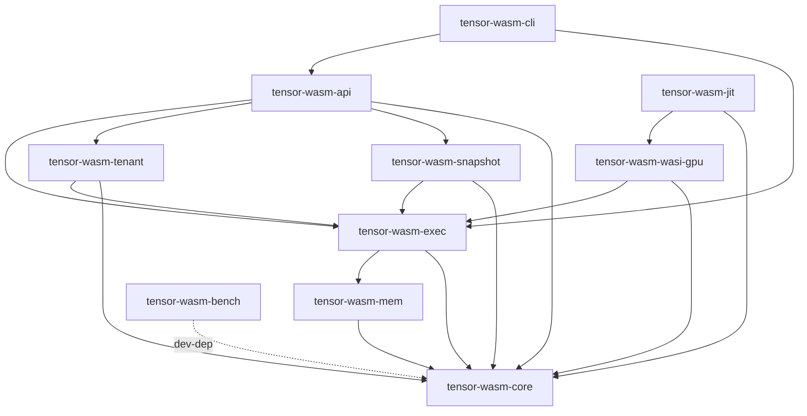

# Craton TensorWasm — Architecture

Craton TensorWasm is a GPU-accelerated serverless Wasm runtime. It runs untrusted Wasm modules with explicit (and later, auto-offloaded) GPU kernel dispatch on CUDA, built on Wasmtime and Tokio. The project is a 9-month build spanning 22 sessions across 6 phases.

## Workspace layout

The workspace is composed of ten crates:

- `tensor-wasm-core` — Foundational types, errors, metrics, telemetry.
- `tensor-wasm-mem` — CUDA Unified Memory allocator and Wasmtime `MemoryCreator`.
- `tensor-wasm-exec` — Wasmtime + Tokio async execution engine.
- `tensor-wasm-wasi-gpu` — `wasi-cuda` host bridge for explicit GPU kernel launch.
- `tensor-wasm-jit` — JIT pipeline: detector, IR, PTX codegen, kernel cache, deopt.
- `tensor-wasm-snapshot` — Wasm + GPU memory snapshot and restore.
- `tensor-wasm-tenant` — Multi-tenant CUDA context management.
- `tensor-wasm-api` — HTTP serverless API gateway (axum).
- `tensor-wasm-cli` — Developer CLI (`tensor-wasm` binary).
- `tensor-wasm-bench` — Benchmark harness (Criterion + custom).

## Dependency graph (planned, acyclic)

The crates are layered top-down — higher layers depend on lower layers, never the reverse.

```
            tensor-wasm-cli ──► tensor-wasm-api
                            │
        ┌───────────────────┼──────────────────────┐
        ▼                   ▼                      ▼
   tensor-wasm-snapshot      tensor-wasm-tenant            (tensor-wasm-bench)
        │                   │
        └─────────┬─────────┘
                  ▼
              tensor-wasm-jit
                  │
                  ▼
            tensor-wasm-wasi-gpu
                  │
                  ▼
              tensor-wasm-exec
                  │
                  ▼
              tensor-wasm-mem
                  │
                  ▼
              tensor-wasm-core
```

The dependency graph is acyclic. `tensor-wasm-core` has zero internal dependencies; every other crate depends transitively on `tensor-wasm-core`.



In S1 these dependencies are **not yet wired** in `Cargo.toml` — every crate's manifest is currently empty. Wiring happens incrementally as later sessions need it. This document describes the *planned end state*.

## Six phases

| Phase | Sessions | Theme | Months |
|-------|----------|-------|--------|
| 0 | S1–S3 | Foundation | 0–1 |
| 1 | S4–S6 | Memory | 1–2 |
| 2 | S7–S9 | Execution | 3–4 |
| 3 | S10–S14 | JIT compiler | 5–7 |
| 4 | S15–S18 | Serverless | 8–9 |
| 5 | S19–S22 | Hardening & release | 9–10 |

## Build matrix

The workspace must support three build configurations (defined fully in S2):

1. **CUDA host** — `--features unified-memory`: real `cudaMallocManaged` against a host CUDA installation.
2. **CUDA stub** — stub libs placed on `LD_LIBRARY_PATH`. This is the CI default and is exactly what S1's CI workflow exercises.
3. **No CUDA** — `--no-default-features`: the `PinnedHostBuffer` fallback path, with no CUDA linkage at all.

## Cross-references

Related documents authored in later sessions:

- `docs/CUDA-SETUP.md` (S2)
- `docs/BUILD.md` (S2)
- `SECURITY.md` (S6)
- `docs/AUTO-OFFLOAD.md` (S14)
- `docs/COLD-START.md` (S15)
- `docs/MPS-SETUP.md` (S16)
- `tensor-wasm-api/API.md` (S17)
- `docs/CLI.md` (S18)
- `docs/PERFORMANCE.md` (S19)
- `docs/OBSERVABILITY.md` (S20)
- `docs/SECURITY-AUDIT.md` (S21)

---

_Status: current as of v0.1.0 (2026-05-24). All crates wired; see CHANGELOG.md for history._
