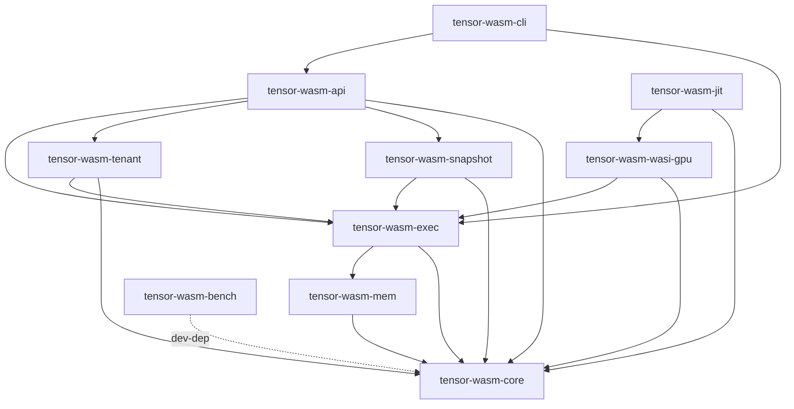

# Craton TensorWasm — Architecture

Craton TensorWasm is a GPU-accelerated serverless Wasm runtime. It runs untrusted Wasm modules with explicit (and later, auto-offloaded) GPU kernel dispatch on CUDA, built on Wasmtime and Tokio. Active development since 2025.

## Workspace layout

The workspace is composed of ten crates:

- `tensor-wasm-core` — Foundational types, errors, metrics, telemetry.
- `tensor-wasm-mem` — CUDA Unified Memory allocator and Wasmtime `MemoryCreator`.
- `tensor-wasm-exec` — Wasmtime + Tokio async execution engine.
- `tensor-wasm-wasi-gpu` — `wasi-cuda` host bridge for explicit GPU kernel launch.
- `tensor-wasm-jit` — JIT pipeline: detector, IR, PTX codegen, kernel cache, deopt.
- `tensor-wasm-snapshot` — Wasm + GPU memory snapshot and restore.
- `tensor-wasm-tenant` — Multi-tenant CUDA context management.
- `tensor-wasm-api` — HTTP serverless API gateway (axum).
- `tensor-wasm-cli` — Developer CLI (`tensor-wasm` binary).
- `tensor-wasm-bench` — Benchmark harness (Criterion + custom).

## Dependency graph (planned, acyclic)

The crates are layered top-down — higher layers depend on lower layers, never the reverse.

```
            tensor-wasm-cli ──► tensor-wasm-api
                            │
        ┌───────────────────┼──────────────────────┐
        ▼                   ▼                      ▼
   tensor-wasm-snapshot      tensor-wasm-tenant            (tensor-wasm-bench)
        │                   │
        └─────────┬─────────┘
                  ▼
              tensor-wasm-jit
                  │
                  ▼
            tensor-wasm-wasi-gpu
                  │
                  ▼
              tensor-wasm-exec
                  │
                  ▼
              tensor-wasm-mem
                  │
                  ▼
              tensor-wasm-core
```

The dependency graph is acyclic. `tensor-wasm-core` has zero internal dependencies; every other crate depends transitively on `tensor-wasm-core`.



In S1 these dependencies are **not yet wired** in `Cargo.toml` — every crate's manifest is currently empty. Wiring happens incrementally as later sessions need it. This document describes the *planned end state*.

## Per-crate module breakdown

The internal module layout below reflects the state after the W1–W4 waves. New modules carry their landing wave in parentheses; existing modules are listed for orientation only.

### tensor-wasm-core

- `error.rs` — workspace-wide `TensorWasmError` and conversions.
- `types.rs` — newtype IDs (`TenantId`, `InstanceId`, etc.) and shared value types.
- `metrics.rs` — `TensorWasmMetrics` registry; now hosts the HTTP request families (`http_requests_total`, `http_request_duration_seconds`, `http_requests_in_flight`) added in W2.3 and the `tensor_wasm_build_info` info-style gauge added in W4.9. Build-time constants (`BUILD_VERSION`, `BUILD_GIT_SHA`, `BUILD_RUSTC_VERSION`, `BUILD_PROFILE`, `BUILD_TARGET`) are populated by `build.rs`.
- `telemetry.rs` — `tracing-subscriber` init, optional OTLP exporter, and the trace-provider hook the API gateway pairs with its W4.1 W3C propagator install.

### tensor-wasm-mem

- `unified.rs` — `UnifiedBuffer` over `cudaMallocManaged` (or heap fallback).
- `pinned_host.rs` — guarded host buffer for the no-CUDA path.
- `pool.rs` — slab-style allocator over `UnifiedBuffer`.
- `advise.rs` — `cudaMemAdvise` wrapper.
- `isolation.rs`, `wasm_memory.rs` — Wasmtime `MemoryCreator` glue.
- `cudarc_backend.rs` (W1.2, feature-gated on `cudarc-backend`) — parallel `CudarcUnifiedBuffer` + `apply_advice` mirroring the `cust` path for the cust → cudarc migration spike. See `docs/CUDARC-SPIKE.md`.

### tensor-wasm-wasi-gpu

- `abi.rs` — wire-format error codes and shared ABI constants.
- `host.rs` — host-side implementations of the `wasi:cuda` functions registered with `wasmtime::Linker`.
- `registry.rs` — kernel registry plumbing.
- `async_dispatch.rs` — async stream dispatch helpers.
- `kernel_args.rs` (W1.1) — typed `(tag, value)` argv lowering for `wasi:cuda` `launch`; bounds-checks pointer arguments against guest linear memory before they reach `cuLaunchKernel`.

### tensor-wasm-snapshot

- `src/writer.rs`, `src/reader.rs` — capture and strict restore of the zstd + bincode wire format. Existing.
- `tests/{round_trip, restore_validation, crc_mismatch_explicit, decompressed_cap_rejected, malicious_bincode_lengths, max_input_rejected, old_version_rejected}.rs` — existing reader/writer regression tests.
- `tests/compat.rs` (W1.3) — cross-version regression guard for the v0.5 compatibility promise; loads checked-in golden fixtures and asserts the current reader accepts them.
- `examples/generate_golden.rs` (W1.3) — deterministic generator that produces the `golden_v0_1_0_*.snap` fixtures consumed by `tests/compat.rs`.

### tensor-wasm-api

- `middleware.rs` — tower layers for timeouts, concurrency caps, body limits, bearer auth, tenant scoping, and the tracing span layer (`trace_layer_with_propagation`).
- `server.rs` — `build_router` composes the middleware stack and binds the listener.
- `routes.rs` — deploy / invoke / metrics / healthz / jobs REST handlers.
- `rate_limit.rs` (W1.4) — per-token QPS + burst token-bucket layer (refill-on-take, sharded under `DashMap`); layered behind `bearer_auth`.
- `token_scope.rs` (W2.1) — `:tenant=` clause parser for `TENSOR_WASM_API_TOKENS` and per-tenant `authorize_tenant` enforcement returning `403 tenant_scope_denied`.
- `audit.rs` (W2.2) — structured JSON audit log for state-mutating requests; one record per request with actor / action / resource / outcome / latency fields. See `docs/AUDIT-LOG.md`.
- `http_metrics.rs` (W2.3) — middleware emitting the three HTTP series declared in `tensor_wasm_core::metrics`, with a runtime route-template allow-list for cardinality control.
- `trace_propagation.rs` (W4.1) — idempotent W3C `TraceContextPropagator` installer plus `HeaderMapExtractor` / `extract_parent_context` / `current_trace_id` helpers used by `middleware::trace_layer_with_propagation`.

### tensor-wasm-cli

- `cmd/{run, deploy, invoke, bench, snapshot, metrics, completions}.rs` — existing subcommands.
- `cmd/observe.rs` (W1.5) — `tensor-wasm observe`, a one-screen operator dashboard that polls `/healthz` + `/metrics` and rewrites the terminal in place; consumes the W2.3 HTTP series for per-route rate and latency cells.
- `cmd/man.rs` (W2.4) — `tensor-wasm man`, walks the clap `Command` tree and renders one roff `.1` page per node via `clap_mangen`.

### tensor-wasm-bench

- `benches/{cold_start, e2e_inference, jit_compile, kernel_dispatch, memory_bandwidth}.rs` — existing Criterion suites.
- `benches/tail_latency.rs` (W4.6) — hand-rolled sampling loop (10 000 raw `Duration`s, nearest-rank percentiles) that publishes P99 / P99.9 for the `dispatch/*` and `e2e/*` groups, sidestepping Criterion's ~100-sample default.

## Feature flag interactions

The three build configurations described above (CUDA host, CUDA stub, no CUDA) are the supported matrix. Two additional opt-in features layer on top:

- `cudarc-backend` (`tensor-wasm-mem`, W1.2) — compiles the parallel `cudarc_backend` module alongside the default `cust` path. Both backends coexist in the binary so tests and benches can exercise them on the same host without recompiling; production call sites continue to use `UnifiedBuffer` (cust) by default. This feature is independent of `unified-memory`: enabling it without a real CUDA installation will fail at link time on `cudarc::driver::sys`, the same posture as `unified-memory`. The spike is tracked in `docs/CUDARC-SPIKE.md` and the risk register.
- `otlp` (`tensor-wasm-core`) — gates `init_with_otlp` in `telemetry.rs`. The API gateway's W4.1 W3C propagator install in `trace_propagation.rs` is **unconditional** and does not depend on this feature: without it the middleware would silently drop client `traceparent` headers even on deployments that have no OTLP exporter wired.

## Six phases

| Phase | Sessions | Theme | Months |
|-------|----------|-------|--------|
| 0 | S1–S3 | Foundation | 0–1 |
| 1 | S4–S6 | Memory | 1–2 |
| 2 | S7–S9 | Execution | 3–4 |
| 3 | S10–S14 | JIT compiler | 5–7 |
| 4 | S15–S18 | Serverless | 8–9 |
| 5 | S19–S22 | Hardening & release | 9–10 |

## Build matrix

The workspace must support three build configurations (defined fully in S2):

1. **CUDA host** — `--features unified-memory`: real `cudaMallocManaged` against a host CUDA installation.
2. **CUDA stub** — stub libs placed on `LD_LIBRARY_PATH`. This is the CI default and is exactly what S1's CI workflow exercises.
3. **No CUDA** — `--no-default-features`: the `PinnedHostBuffer` fallback path, with no CUDA linkage at all.

## Cross-references

Related documents authored in later sessions:

- `docs/CUDA-SETUP.md` (S2)
- `docs/BUILD.md` (S2)
- `SECURITY.md` (S6)
- `docs/AUTO-OFFLOAD.md` (S14)
- `docs/COLD-START.md` (S15)
- `docs/MPS-SETUP.md` (S16)
- `tensor-wasm-api/API.md` (S17)
- `docs/CLI.md` (S18)
- `docs/PERFORMANCE.md` (S19)
- `docs/OBSERVABILITY.md` (S20)
- `docs/SECURITY-AUDIT.md` (S21)

---

_Status: current as of v0.3.5 (2026-05-27). All crates wired; see CHANGELOG.md for history._
